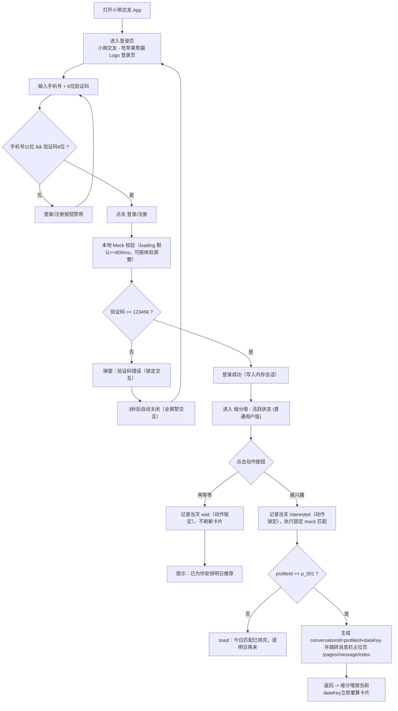

# Panda Mobile 交互流程图 (V0.6)

## 1. 主流程（D5 P0）

## 2. 异常处理

1. 验证码错误：弹窗显示 `验证码错误`，3 秒自动关闭。
2. 错误弹窗显示期间全屏完全禁交互（不允许手动关闭、重复提交、输入编辑、页面点击与系统返回）。
3. 协议/隐私 toast 1500ms 内不重复弹出，且两者各自独立节流。
4. 输入格式不合法时不触发 mock 校验，提交按钮保持禁用。

## 3. 说明

1. 当前流程覆盖登录、缘分墙动作闭环与消息栏占位页跳转。
2. MVP 不依赖真实后端，不持久化登录状态；仅保留内存会话。
3. 内存会话仅在 App 进程被杀后清空，前后台切换不清空。
4. 缘分墙本轮仅做成功路径，不实现错误分支；资料从 `panda-mobile/mock/affinity-profiles.mock.json` 按 `userId+dateKey` 稳定选择 1 条展示。
5. 协议/隐私入口分别使用 toast 占位：`用户协议建设中` / `隐私政策建设中`（1500ms 各自独立节流）。
6. 同一自然日内（含重新登录）不刷新下一张推荐卡片；`再等等` 会在下一天再推荐。
7. `再等等` toast 在 MVP 固定为 `已为你安排明日推荐`。
8. 消息页当前仅占位，不实现真实聊天能力。
9. 动作点击即锁定，当天不可改选；锁定后再次点击静默忽略（不弹 toast）。
10. 日期边界按设备本地自然日（00:00）计算，并在 00:00 自动重置推荐与动作锁定。
11. App 进程被杀后动作锁定不保留，但重新登录仍展示当天同一推荐对象。
12. 用户停留在缘分墙页面跨越 00:00 时，立即重置并换到历史未推荐卡片，不等待下次交互或 `onShow`。
13. 推荐对象按用户循环历史去重：当前循环内已推荐对象后续不再重复推荐。
14. 若未推荐池耗尽，当日保持当前卡片；下一天 00:00 重置循环历史后重新循环推荐。
15. 次日 00:00 进入新循环后，首个推荐对象优先不等于上一自然日最后展示对象。
16. 长期历史仅在卸载/清除应用数据时清空。
17. 消息占位页在 MVP 阶段不处理跨 00:00 特殊逻辑。
18. 从消息占位页返回缘分墙时，按返回当下 `dateKey` 立即重算并展示当前应展示卡片。
19. “上一自然日最后展示对象”按系统最后一次成功分配推荐对象定义；若无可选候选满足不重复，允许降级重复上一日末卡。
20. `login_submit_blocked` 在首次进入页面初始非法态不触发。
