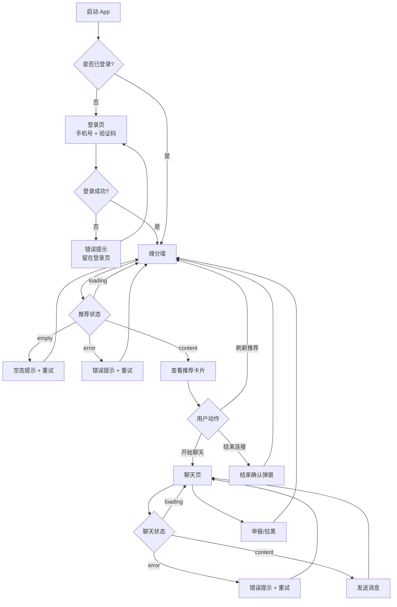

# Panda Mobile 交互流程图

## 1. 主流程（MVP）

```mermaid
flowchart TD
  A["启动 App"] --> B{"是否已登录?"}
  B -- "否" --> C["登录页<br/>手机号 + 验证码"]
  C --> D{"登录成功?"}
  D -- "否" --> E["错误提示<br/>留在登录页"]
  E --> C
  D -- "是" --> F["缘分墙"]
  B -- "是" --> F

  F --> G{"推荐状态"}
  G -- "loading" --> F
  G -- "empty" --> H["空态提示 + 重试"]
  H --> F
  G -- "error" --> I["错误提示 + 重试"]
  I --> F
  G -- "content" --> J["查看推荐卡片"]

  J --> K{"用户动作"}
  K -- "开始聊天" --> L["聊天页"]
  K -- "刷新推荐" --> F
  K -- "结束连接" --> M["结束确认弹窗"]
  M --> F

  L --> N{"聊天状态"}
  N -- "loading" --> L
  N -- "error" --> O["错误提示 + 重试"]
  O --> L
  N -- "content" --> P["发送消息"]
  P --> L

  L --> Q["举报/拉黑"]
  Q --> F
```

## 2. 异常流

1. 登录失败：保留输入并提示可操作错误信息。
2. 推荐拉取失败：不跳页，原地重试。
3. 消息发送失败：不丢草稿，允许重发。

## 3. 合规必备入口

1. 聊天页可达举报/拉黑。
2. 设置页可达账号删除与隐私政策。

