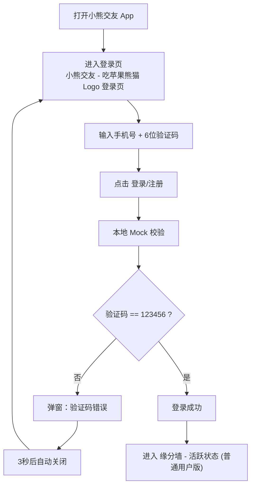

# Panda Mobile 交互流程图 (V0.2)

## 1. 主流程（MVP）

## 2. 异常处理

1. 验证码错误：弹窗显示 `验证码错误`，3 秒自动关闭。
2. mock service 异常：沿用同一错误提示策略，停留登录页重试。

## 3. 说明

1. 当前流程仅覆盖登录与进入缘分墙活跃态。
2. MVP 不依赖真实后端，不持久化登录状态。
3. 聊天、匹配策略等均不在本轮范围内。

