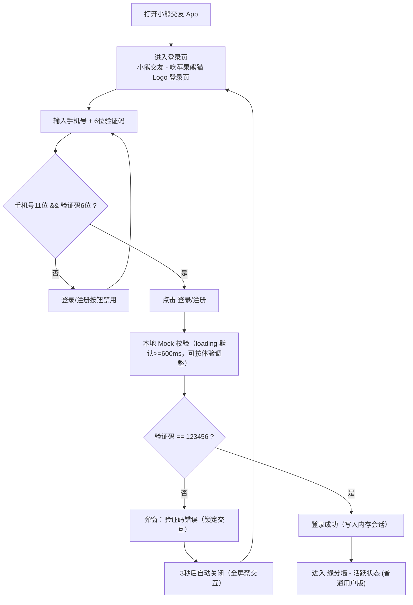

# Panda Mobile 交互流程图 (V0.5)

## 1. 主流程（MVP）

## 2. 异常处理

1. 验证码错误：弹窗显示 `验证码错误`，3 秒自动关闭。
2. 错误弹窗显示期间全屏完全禁交互（不允许手动关闭、重复提交、输入编辑、页面点击与系统返回）。
3. 协议/隐私 toast 1500ms 内不重复弹出，且两者各自独立节流。
4. 输入格式不合法时不触发 mock 校验，提交按钮保持禁用。

## 3. 说明

1. 当前流程仅覆盖登录与进入缘分墙活跃态。
2. MVP 不依赖真实后端，不持久化登录状态；仅保留内存会话。
3. 内存会话仅在 App 进程被杀后清空，前后台切换不清空。
4. 缘分墙本轮仅做成功路径，不实现错误分支；资料从 `panda-mobile/mock/affinity-profiles.mock.json` 随机 1 条展示。
5. 协议/隐私入口分别使用 toast 占位：`用户协议建设中` / `隐私政策建设中`（1500ms 各自独立节流）。
6. 聊天、匹配策略等均不在本轮范围内。
